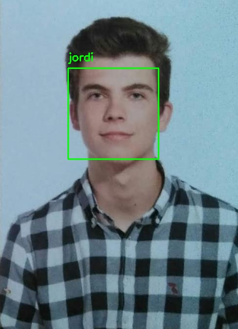
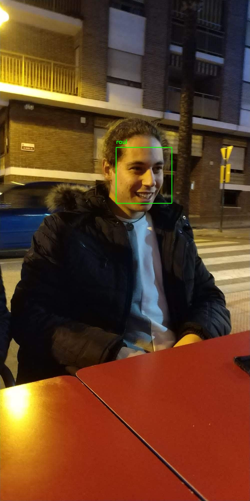

# React_DjangoRF

Photo gallery web application deployed with docker that auto detects the faces on the images and label them when uploaded with the name of the person.

## Preview

This is how the application looks, it shows the process of upload an image.


This is what the backend is actually getting.




## Features

| Service | Description |
| - | - |
| Layout | The container of the application |
| Gallery | Where all images are displayed with tags |
| Login | Regular login with JWT |
| Register | Regular register with JWT |
| Face Recognition | When a image is uploaded, it automatically detects the face and labels it(if there are any match) |

## Technologies

### Frontend

* [React](https://reactjs.org/) - The frontend library
* [Redux](https://redux.js.org/) - A predictable state container
* [MaterialUI](https://material-ui.com/es/) - User Interface
* [react-grid-gallery](https://benhowell.github.io/react-grid-gallery/) - GooglePhotos gallery
* [notistack](https://github.com/iamhosseindhv/notistack) - Notifications
* [toastr](https://www.npmjs.com/package/toastr) - Notifications

### Backend

* [Django Rest Framework](https://www.django-rest-framework.org/) - The backend(API REST)
* [pyJWT](https://github.com/jpadilla/pyjwt) - Auth tokens
* [psycopg2](https://www.psycopg.org/) - Connection with database

### Face recognition (<a href="https://www.pyimagesearch.com/2018/06/18/face-recognition-with-opencv-python-and-deep-learning/#">codebase</a>)

* [opencv-python](https://opencv.org/) - Open Source Computer Vision Library
* [dlib](https://github.com/davisking/dlib) -  C++ toolkit containing machine learning algorithms
* [face-recognition](https://github.com/ageitgey/face_recognition) - Face recognition API
* [numpy](https://numpy.org/) - Scientific computing library
* [Pillow](https://python-pillow.org/) - Python Imaging Library


### Deploy

* [Docker](https://www.docker.com/) - Containers

### Database

* [PostgreSQL](https://www.postgresql.org/) - Relational database


## Deploying the backend to support GPU processing

### Docker compose
Version of docker-compose:
```dockerfile
version: "2.3"
```

Ubuntu with CUDA and CUDNN

```dockerfile
image: nvidia/cuda:10.1-cudnn7-devel
```

Runtime (this is the reason to use v2.3):
```dockerfile
runtime: "nvidia"
```

Environment variables:
```dockerfile
environment:
      - NVIDIA_VISIBLE_DEVICES=all
```

Sharing host's GPU with the container:
```dockerfile
    devices:
      - /dev/nvidia0:/dev/nvidia0
      - /dev/nvidiactl:/dev/nvidiactl
      - /dev/nvidia-modeset:/dev/nvidia-modeset
```


### Files

(In backend/utils/face_recognition)


encode_faces.py
: Script to encode the faces of the datasets into files(pickle)

lib_detect_faces.py
: Library that recognize the faces on the image

image_resizer.py
: Script that reduce the size of the image(My 2GB GPU cannot process a big image)

increase_dataset.py
: It generates extra images from a image base, modifying each image and adding zooms, flips, deformations...

The other files aren't in use rigth now.


## File structure
```
.
├── backend
│   ├── apps
│   │   ├── authentication
│   │   ├── core
│   │   ├── profiles
│   │   └── userimages
│   │       
│   ├── images
│   └── utils
│       └── face_recognition
│           ├── dataset
│           │   ├── jordi
│           │   └── raul
│           ├── output
│           └── pickles
│
├── frontend
│   ├── public
│   └── src
│       ├── components
│       │   ├── Auth
│       │   ├── Common
│       │   ├── Layout
│       │   └── Photos
│       ├── constants
│       └── reducers
└── readme_media
```


